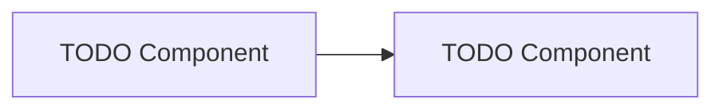

# {title}

> **Status:** Draft · **Owner:** {owner} · **Created:** {date}
{{.is-info}}

## Contexto

[TODO: descrever o problema/domínio. Por que esse componente existe? Qual capability de negócio ele suporta?]

## Requisitos Funcionais

- [TODO: o que o sistema DEVE fazer]
- [TODO]

## Requisitos Não-Funcionais

- **Disponibilidade:** [TODO: 99.9% / 99.95% / etc.]
- **Latência:** [TODO: p95, p99 targets]
- **Throughput:** [TODO: req/s]
- **Segurança:** [TODO: multi-tenant? PII? PCI?]
- **Compliance:** [TODO: SOC2 / LGPD / PCI-DSS]

## Componentes

[TODO: liste componentes principais. Use diagrama Mermaid se possível.]

## Data Flow

[TODO: como os dados fluem end-to-end. Origem → transformações → destino.]

1. [TODO]
2. [TODO]

## Failure Modes

| Falha | Detecção | Mitigação |
|-------|----------|-----------|
| [TODO] | [TODO alerta/log] | [TODO retry / fallback / degrade] |
| [TODO] | [TODO] | [TODO] |

## Deploy / Rollback

- **Estratégia de deploy:** [TODO: blue-green / canary / rolling]
- **Rollback:** [TODO: helm rollback / ArgoCD revert / feature flag flip]
- **Feature flags:** [TODO: quais flags gate esse componente]

## ADRs Relacionadas

- [TODO: ADR-XXXX — decisão relevante]
